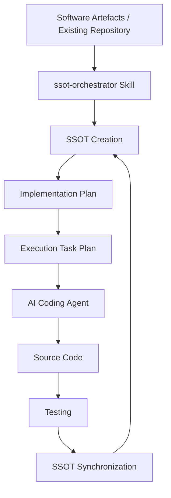

# SSOT-Centric Agentic Software Engineering Framework

SSOT-Centric Agentic Software Engineering Framework\
Version 1.0\
Author: Emmanuel Echeonwu\
First Published: 2026

## Overview

The SSOT-Centric Agentic Software Engineering Framework is an AI-native
software development lifecycle model that enables software engineering
artefacts, AI planning systems, coding agents, testing agents, and
continuous system evolution to operate from a shared system knowledge
foundation.

The framework introduces a Single Source of Truth (SSOT) as the central
intelligence layer that maintains alignment between requirements,
architecture decisions, implementation strategy, source code, testing,
and future system changes. 

This framework is created using the AI-native software Engineering toolkit ( A set of AI agent skills) specially created for Agentic Software Engineering. Download the AI Agent Skills toolkit and place in your agent skills folder for your AI Agent Coder.

The framework separates:

- SSOT: System understanding and architectural truth

- Implementation Plan: Architecture-driven implementation strategy

- Task Plan: Execution-level engineering activities

- Source Code and Tests: Software implementation and validation

## Lifecycle

```text
Engineering Artefacts
(SRD, TDD, ADRs, C4, Technical Evaluation)

                |
                v

              SSOT
           (knowledge)

                |
                v

       Implementation Plan
   (Architecture-first approach)

                |
                v

          Task Plan
   (Execution implementation tasks)
(can also be generated from SRD + TDD )

                |
                v

        AI Coding Agents

                |
                v

       Source Code + Tests

                |
                v

       SSOT Synchronization
```

# Repository Structure

```text
ssot_centric_framework/

        ├── knowledge/
        │   └── SSOT containing System knowledge and architectural truth
        │
        ├── implementation_plan/
        │   └── SSOT-derived implementation strategy
        │
        ├── task_plan/
        │   └── SRD and TDD-derived execution tasks or from ssot-derived implementation plan
        │
        ├── src/
        │   └── Application source code
        │
        ├── tests/
        │   └── Test artefacts
        │
        └── priority.md
            └── AI agent implementation instructions
```

# Directory Responsibilities

## knowledge/

Contains the authoritative representation of the system.

Generated from:

- Software Requirements Document (SRD)

- Technical Design Document (TDD)

- Architecture Decision Records (ADRs)

- C4 diagrams

- Technical analysis

- Existing repository context

The SSOT maintains:

- Product knowledge

- Architecture knowledge

- System behaviour

- Engineering constraints

- Security knowledge

- Testing strategy

## implementation\_plan/

The implementation plan is derived from the SSOT.

It defines:

- Architectural implementation strategy

- Development sequence

- Component evolution

- Dependencies

- Technical constraints

It answers:

> How should the system be built while preserving architectural intent?

## task\_plan/

The task plan is derived from:

- SRD

- TDD

It defines:

- Coding tasks

- File changes

- Implementation steps

- Validation requirements

It answers:

> What specific engineering actions must be completed?

## src/

Contains the software implementation.

All changes must comply with:

- SSOT rules

- Implementation Plan

- Task Plan

## tests/

Contains:

- Unit tests

- Integration tests

- End-to-end tests

- Validation artefacts

# Priority of Truth

AI agents must follow this order:

1. SSOT
2. Implementation Plan
3. Task Plan
4. Existing Source Code
5. New Implementation Decisions

When conflicts occur:

- SSOT has highest authority.

- Implementation decisions must align with SSOT.

- Task execution must respect architecture.

- Changes affecting system behaviour must update SSOT.

# AI Coding Agent Context

The AI coding agent receives:

```text
/knowledge

/implementation_plan

/task_plan

priority.md
```

Workflow:

```text
Load System Context
        |
Review Implementation Strategy
        |
Review Execution Tasks
        |
Implement Changes
        |
Run Tests
        |
Synchronize SSOT
```

# How to Use the SSOT-Centric Agentic Software Engineering Framework


The SSOT-Centric Agentic Software Engineering Framework is designed to operate as part of an **AI-native Software Engineering Toolkit**.

The framework itself is generated and maintained through the **ssot-orchestrator skill**, which coordinates the creation, synchronization, and evolution of the Single Source of Truth (SSOT) throughout the software engineering lifecycle.

The framework can be created in two primary scenarios:

1. **New Software Projects**
   - Using existing software engineering artefacts such as:
     - Software Requirements Document (SRD)
     - Technical Design Document (TDD)
     - Architecture Decision Records (ADRs)
     - C4 Architecture Diagrams
     - Technical Evaluations

2. **Existing Software Repositories**
   - By analyzing an existing codebase and discovering:
     - system architecture
     - component relationships
     - implementation patterns
     - technical constraints
     - existing behaviours

The generated SSOT becomes the foundation for AI-native development activities.

***

# Prerequisites

The SSOT-Centric Framework depends on the **AI-native Software Engineering Toolkit**.

The toolkit provides a collection of specialized engineering skills that can be independently downloaded from [here](\[https://github.com/eecheonwu/AI-native_software_engineering_Agent_toolkit/releases/tag/v1.0.0])  and copied directly into your AI coding agent skills directory.

Example:

```
AI Coding Agent

      |
      |
      ↓

Skills Directory

      |
      |
      ├── requirements-skill
      ├── architecture-skill
      ├── ADR-skill
      ├── C4-skill
      ├── implementation-skill
      ├── testing-skill
      ├── security-skill
      ├── deployment-skill
      └── ssot-orchestrator
```

The `ssot-orchestrator` skill coordinates these capabilities to create and maintain the SSOT.

***

# Creating an SSOT from Software Artefacts

For a new project, the recommended workflow is:

```
Engineering Artefacts

(SRD, TDD, ADRs, C4, Technical Evaluation)

                ↓

        ssot-orchestrator

                ↓

              SSOT

                ↓

     Implementation Plan

                ↓

      Execution Task Plan

                ↓

        AI Agent Development
```

The AI agent is instructed to create the SSOT by providing a prompt such as:

```
Create the SSOT for this software project using the available engineering artefacts.

Analyse:
- SRD
- TDD
- ADRs
- C4 diagrams
- Technical evaluation

Generate the SSOT structure required to support AI-native software development.
```

The `ssot-orchestrator` skill will:

- analyse the artefacts
- extract system knowledge
- identify architecture decisions
- organize system context
- create the SSOT structure

***

# Creating an SSOT from an Existing Repository

The framework can also be introduced into an existing project.

The AI agent is instructed:

```
Analyze this repository and create an SSOT representation of the existing system.

Discover:
- architecture
- components
- dependencies
- implementation patterns
- technical constraints
- testing strategy

Create the SSOT structure that represents the current system state.
```

The AI agent will analyse:

- source code
- project structure
- configuration files
- dependencies
- tests
- documentation

and produce a system knowledge representation.

***

# Using the Framework During Development

After SSOT creation, the repository follows the SSOT-Centric workflow:

```
/ssot

        ↓

/implementation_plan

        ↓

/task_plan

        ↓

/src

        ↓

/tests

        ↓

SSOT Synchronization
```

The AI coding agent receives:

```
1. /ssot

2. /implementation_plan

3. /task_plan

4. priority_of_truth.md
```

before implementation begins.

***

# AI Agent Execution Rules

The AI agent must follow the priority hierarchy:

```
1. SSOT

2. Implementation Plan

3. Task Plan

4. Existing Source Code

5. New Implementation Decisions
```

The purpose is to ensure that:

- implementation follows architecture
- tasks do not override system design
- code changes remain aligned with system intent
- knowledge remains synchronized

***

# Maintaining the SSOT

The SSOT is a living system model.

After implementation:

```
Code Changes

      ↓

Testing

      ↓

Architecture Validation

      ↓

SSOT Update
```

Changes that affect:

- requirements
- architecture
- behaviour
- interfaces
- security
- deployment

must update the SSOT.

***

# Recommended AI-Native Workflow

A complete lifecycle using this framework:



***

# Toolkit Relationship

The SSOT-Centric Agentic Software Engineering Framework should be viewed as a capability layer inside a larger AI-native engineering ecosystem.

The toolkit provides:

- specialized engineering skills
- domain expertise
- development workflows
- agent coordination capabilities

The SSOT framework provides:

- persistent system knowledge
- architectural memory
- implementation governance
- AI agent context

Together they enable AI agents to operate closer to the behaviour of experienced software engineering teams.

# Core Principles

## SSOT as System Memory

The SSOT is not only documentation. It is the continuously maintained
intelligence layer of the software system.

## Architecture Before Execution

AI agents should understand system intent before modifying
implementation details.

## Separation of Planning Responsibilities

Implementation Plan:

Defines strategic architecture-aware execution.

Task Plan:

Defines concrete engineering actions.

# Benefits

The framework provides:

- Better AI agent context awareness

- Reduced architectural drift

- Improved traceability

- More reliable autonomous development

- Continuous system knowledge evolution

# Future AI Agent Extensions

The framework supports specialized agents:

- Requirements Agent

- Architecture Agent

- Implementation Agent

- Testing Agent

- Security Agent

- Deployment Agent

- SSOT Synchronization Agent

